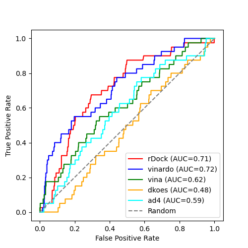

# Comparison of rDock and Smina

**Target**: CDK2.

This is a repeat of the work desscribed for validating rDock and Smina for
DHFR. Look [here](../../../dhfr/expts/vs-dekois/README.md) for that data and
for the methodology.

# Results

| tool            | # actives in top 100 |
|-----------------|----------------------|
| rDock           | 5  |
| Smina - vina    | 7  |
| Smina - vinardo | 13 |
| Smina - dkoes   | 0  |
| Smina - ad4     | 3  |

Whilst rDock is performing quite well, the enrichment is not as good as for DHFR, and Smina with
the vinardo scroring function performs a bit better, especially with early recall. 
The other Smina scoring functions do not perform well.

