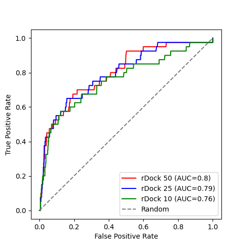

# Comparison of rDock and Smina

This directory contains scripts that allow rDock and Smina to be compared,
using DHFR DEKOIS data. See [here](/datasets/DEKOIS_2.0/README.md) for more
infomation about the data.

There are 40 known actives and 1200 decoys, presumed
to be inactive. This validation checks how good the docking is at ranking the
actives at the top of the predicted binding list.
 

## Step 1. Copy data.
```
./1_copy_files.sh
```

## Step 2. Prepare the inputs
```
./2_prepare_inputs.sh
```

## Step 3. Create rDock cavity defintion
```
./3_create_cavity.sh
```

## Step 4. Run rDock or Smina
```
./4_run_rdock.sh --publish_dir ./results_rdock
```

```
./4_run_smina.sh --scoring_function vina --publish_dir ./results_smina_vina
```
Adjust the parameters to run with the different scoring functions (dkoes_fast, dkoes_scoring, dkoes_scoring_old,
vina, vinardo, ad4_scoring).

Each run takes several hours, depending on your compute power. 

## Step 5. Run ODDT rescoring functions (optional)


## Step 6. Prepare data for ROC calculations
Run this for each of your output datasets, providing the SDF file with the poses as the first parameter
and the field with the score you are interested in as the second parameter.
e.g. for the rDock results use this:
```
./6_prepare_roc.sh results_rdock/results_rdock.sdf SCORE.norm
```
e.g. for the Smina results use something like this:
```
./6_prepare_roc.sh results_smina_ad4/results_smina.sdf minimizedAffinity
```
Running this generates the files `results_1poseperlig.sdf` and `results_1poseperlig.txt` in the current directory.
Copy them to the appropropriate results directory.

## Step 7. Generate ROC curves
This command assumes you have run rDock and have run Smina with the vinardo, vina, dkoes_scoring and ad4_scoring
scoring functions and have copied the `results_1poseperlig.sdf` and `results_1poseperlig.txt` into the appropriate
results directory.
```
./7_generate_roc.sh
```
The ROC curve is found in the file ROC.png.

## Step 8. Count the number of actives in the top 100. 
Sort the results and report the scores:
```
TGT=results_smina_ad4
FLD=minimizedAffinity
docker run -it --rm -v $PWD:/work -w /work -u $(id -u):$(id -g) informaticsmatters/vs-rdock:latest /bin/bash\
  -c "sdsort -n -f$FLD $TGT/results_1poseperlig.sdf\
  | sdreport -c$FLD\
  | fgrep BDB > $TGT/actives-ranked.csv"
```
Change the TGT and FLD variables to reflect the inputs.
Then examine the `actives-ranked.csv` file and see how many are in the top 100.


## Tricks

To get sdfilter to group by the title line use the -s_TITLE1 option. By default it seems to use the
field named `Name` unlike the other rDock tools.

To copy the relevant contents to run for a different target run something like this (having already created the 
destination directory):
```
cp 1_copy_files.sh 2_prepare_inputs.sh 3_create_cavity.sh 4_run_rdock.sh 4_run_smina.sh 5_oddt.sh 6_prepare_roc.sh 7_generate_roc.sh _6_prepare_roc.sh _7_generate_roc.r nextflow.config oddt.nf rdockconfig.prm rdock.nf smina.nf ../../../thrombin/expts/vs-dekois/
```
Then make sure you edit the `1_copy_files.sh` file at that destination. 


## Results


| tool            | # actives in top 100 |
|-----------------|----------------------|
| rDock           | 19 |
| Smina - vinardo | 13 |
| Smina - vina    | 3  |
| Smina - dkoes   | 1  |
| Smina - ad4     | 3  |

rDock is performing quite well.
The Smina results are quite surpising. Whilst the vinardo scoring function performs reasonably well
(but not quite as good as rDock) the other scoring functions behave extremely badly, being no better
than random. The reason is not clear.

Looking the rDock and vina results 6 of the actives were found in the top 100 of both results.

| Molecule    | rDock  rank | Smina vinardo rank |
|-------------|-------------|--------------------|
| BDB50031871 | 8           | 67 |
| BDB50031865 | 10          | 31 |
| BDB50141011 | 35          | 76 |
| BDB50066495 | 39          | 86 |
| BDB50050400 | 49          | 15 |
| BDB19385    | 63          | 9  |

Choosing the top 50 from both rDock and vinardo finds 18 distinct actives, better than the average of the
number from the top 100 of each (16), suggesting that, if computing power is not the limiting factor, it may
be better to run both an combine the results.

### Timings
These are the approximate run times for the different runs (using 24 cores):

| Tool          | Time     |
|---------------|----------|
| rDock         | 84 mins  |
| Smina vinardo | 78 mins  |
| Smina vina    | 80 mins  |
| Smina dkoes   | 149 mins |
| Smina ad4     | 152 mins |


### Top 100 rDock results
```
8,BDB50031871,-2.251
9,BDB18497,-2.228
10,BDB50031865,-2.072
14,BDB50041929,-1.895
22,BDB50041935,-1.773
25,BDB50232529,-1.728
28,BDB50058517,-1.707
30,BDB50026300,-1.680
35,BDB50141011,-1.668
39,BDB50066495,-1.653
40,BDB18045,-1.640
43,BDB50066490,-1.608
49,BDB50050400,-1.555
50,BDB50051923,-1.549
51,BDB18246,-1.539
63,BDB19385,-1.493
67,BDB50065297,-1.481
69,BDB50031864,-1.476
87,BDB50054512,-1.434
```

### Top 100 Smina/vinardo results
```
9,BDB19385,-11.427
11,BDB50145797,-11.328
15,BDB50050400,-11.264
17,BDB50158569,-11.261
31,BDB50031865,-10.893
46,BDB18771,-10.706
67,BDB50031871,-10.554
70,BDB50015707,-10.519
71,BDB50288820,-10.517
75,BDB50049156,-10.484
76,BDB50141011,-10.476
86,BDB50066495,-10.401
90,BDB50141012,-10.358
```

### Number of poses needed
The rDock runs analysed above used 50 poses for each ligand. Can we get similar results with
fewer poses. We don't need to re-run the docking, we can just use the ones from the 50 poses
but only use the first n poses.

All we need to do is slightly change the way we generate the data for the ROC curves.
The `6_prepare_roc.sh` script can take an optional third argument limiting the number of
poses that are used. For instance, to use 25 poses execute this:
```
./6_prepare_roc.sh results_rdock/results_rdock.sdf SCORE.norm 25
```
That will generate files named `results_1poseperlig_from25.txt` and `results_1poseperlig_from25.sdf`.
Copy them to the results_rdock directory and generate the ROC curve liek this (assuming you have generated
data for 25 and 10 poses):
```
docker run -it --rm -v $PWD:/work -w /work -u $(id -u):$(id -g) informaticsmatters/vs-prep /code/calculate-roc-curves.py\
  --actives-file-name actives.txt -o ROC-numposes.png\
  -p1 results_rdock/results_1poseperlig.txt -l1 "rDock 50"\
  -p2 results_rdock/results_1poseperlig_from25.txt -l2 "rDock 25"\
  -p3 results_rdock/results_1poseperlig_from10.txt -l3 "rDock 10"
```
It would also be of interest to evaluate rDock's [HT protocol](http://rdock.sourceforge.net/multistep-protocol-for-htvs/)
but the DEKOIS datasets are not really big enough to allow this.



In all three cases 19 actives were found in the top 100 hits.
This suggests that the number of docking poses generated can be reduced from 50 without having
a major impact on the results. Note that this may not be the case when rDock does not perform as
well as it does for this DHFR target. 

## Other results

This approach has been run on some other targets:

* [CDK2](../../../cdk2/expts/vs-dekois)
* [SARS-Cov](../../../sars-cov-3cpr/expts/vs-dekois)
* [Thrombin](../../../thrombin/expts/vs-dekois)

