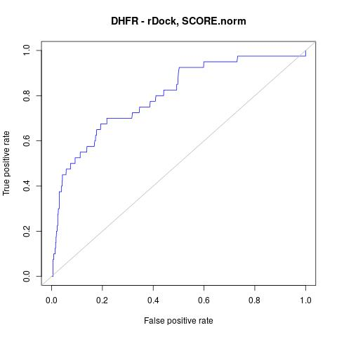
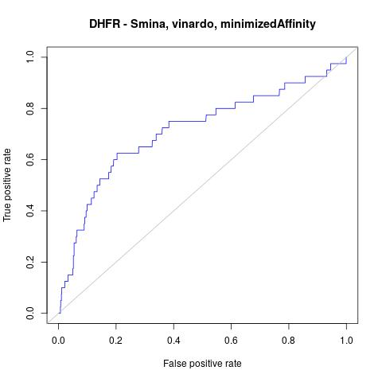
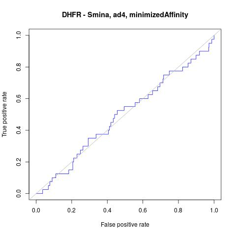

# Comparison of rDock and Smina

This directory contains scripts that allow rDock and Smina to be compared,
using DHFR DEKOIS data 

## Step 1. Copy data.
```
./1_copy_files.sh
```

## Step 2. Prepare the inputs
```
2_prepare_inputs.sh
```

## Step 3. Create rDock cavity defintion
```
3_create_cavity.sh
```

## Step 4. Run rDock or Smina
```
4_run_rdock.sh --publish_dir ./results_rdock
```

```
4_run_smina.sh --scoring_function vina --publish_dir ./results_smina_vina
```
Adjust the parameters to run with the different scoring functions (dkoes_fast, dkoes_scoring, dkoes_scoring_old,
vina, vinardo, ad4_scoring).

Each run takes several hours, depending on your compute power. 

## Step 5. Run ODDT rescoring functions (optional)


## Step 6. Prepare data for ROC calculations
Run this for each of your output datasets, providing the SDF file with the poses as the first parameter
and the field with the score you are interested in as the second parameter.
e.g. for the rDock results use this:
```
./6_prepare_roc.sh results_rdock/results_rdock.sdf SCORE.norm
```
e.g. for the Smina results use something lile this:
```
./6_prepare_roc.sh results_smina_ad4/results_smina.sdf minimizedAffinity
```

## Step 7. Generate ROC curves
```
./7_generate_roc.sh
```
You might want to edit the title the ROC curve is givven by editing the title that is defined
in the file `_7_generate_roc.r`.

Running steps 6 and 7 generates the files `results_1poseperlig.sdf`, `dataforR_uq.txt` and `ROC.jpg`.
Copy these into the appropriate directory to stop them being overwritten.

## Step 8. Count the number of actives in the top 100. 
Sort the results and report the scores:
```
sdsort -n -fminimizedAffinity results_smina_ad4/results_1poseperlig.sdf | sdreport -cminimizedAffinity | fgrep BDB > results_smina_ad4/actives-ranked.csv
```
Change the field name and the directory used (3 edits needed).
Then examing the `actives-ranked.csv` file and see how many are in the top 100.


# Tricks

To get sdfilter to group by the title line use the -s_TITLE1 option. By default it seems to use the
field named `Name` unlike the other rDock tools.


# Results

| tool            | ROC curve                               | # actives in top 100 |
|-----------------|-----------------------------------------|----------------------|
| rDock           |          | 19 |
| Smina - vina    |     | 3  |
| Smina - vinardo |  | 13 |
| Smina - dkoes   |    | 1  |
| Smina - ad4     |      | 3  |

rDock is performing quite well.
The Smina results are quite surpising. Whilst the vinardo scoring function performs reasonably well
(but not quite as good as rDock) the other scoring functions behave extremely badly, being no better
than random. The reason is not clear.

