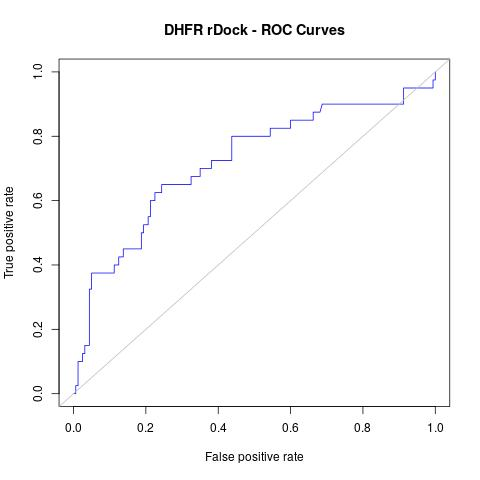

# Validation of docking with rDock using the DEKOIS DHFR dataset

This experiment uses the DEKOIS datasets for DHFR to validate docking with rDock.
The output is a ROC curve showing the enrichment.

The experiment aims to standarize the process so that it can be used as a template fro defining rDock execution
in Squonk. 

## Requirements

Nextflow and Docker must be installed on the host machine.

## To run 

### 1. Copy files

Copy the relevant files from /datasets/DEKOIS_2.0.

```sh
./1_copy_files.sh
```

The results are the files decoys.sdf.gz, actives.sdf.gz, receptor.pdb and xtal-lig.mol2

### 2. Prepare inputs

Use OpenBabel to convert the protein to MOL2 format and the bound ligand to SDF format. 


```sh
./2_prepare_inputs.sh
```

The results are the files receptor.mol2, xtal-lig.sdf and ligands.sdf.gz

### 3. Create cavity

rDock needs a cavity defintion. In this case we use the rbcavity program that uses a cound ligand to define the 
cavity.

```sh
./3_create_cavity.sh
```

The results are the rdockconfig_cav1.grd and rdockconfig.as files.

This runs the rbcavity in the [informaticsmatters/rdock/](https://hub.docker.com/r/informaticsmatters/rdock/) 
Docker image.

### 4. Perform docking with rDock

This runs the docking using [Nextflow](http://nextflow.io) which executes each of the stages, parallelising
the computationally demanding process of doing the actual dockings according to the number of cores on the machine.
See the rdock.nf file for details.

```sh
./4_run_rdock.sh
```
The result is the rdock_results.sdf.gz file.

This uses the [informaticsmatters/rdkit_pipelines](https://hub.docker.com/r/informaticsmatters/rdkit_pipelines/) 
and [informaticsmatters/rdock/](https://hub.docker.com/r/informaticsmatters/rdock/) 
Docker images.

**Note** this will take some time depending on the power of your computer.


### 5. Prepare the ROC curve data

This filters the docked structures to find the best score for each structure and then generates the input
that is needed by R. 

```sh
./5_prepare_roc.sh
```

The result is the file rdock_results_1poseperlig.sdf.gz which contains the best pose for each ligand and data extracted
from that file that is needed by R (the rdock_dataforR_uq.txt).

This uses the [informaticsmatters/rdock](https://hub.docker.com/r/informaticsmatters/rdock/builds/) Docker image
that contains the rDock programs.

### 5. Generate ROC curve

This uses the data from the previous step to geneate a JPG with the ROC curve.

```sh
./5_generate_roc.sh
```

The result is the JPG file cdk2_rdock_ROC.jpg




This uses the [informaticsmatters/r-roc](https://hub.docker.com/r/informaticsmatters/r-roc/builds/) Docker image 
that contains R and the ROCR package.


