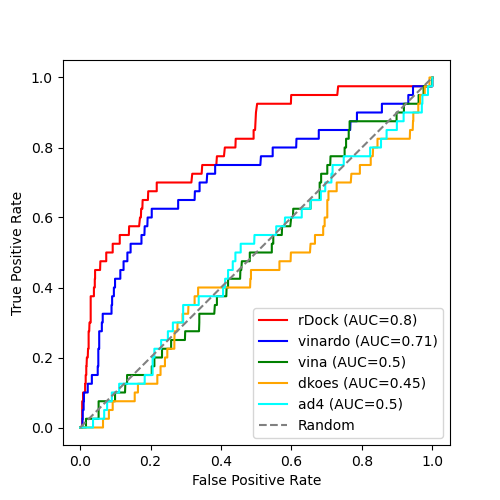

# Comparison of rDock and Smina

This directory contains scripts that allow rDock and Smina to be compared,
using DHFR DEKOIS data. See [here](/datasets/DEKOIS_2.0/README.md) for more
infomation about the data.

There are 40 known actives and 1200 decoys, presumed
to be inactive. This validation checks how good the docking is at ranking the
actives at the top of the predicted binding list.
 

## Step 1. Copy data.
```
./1_copy_files.sh
```

## Step 2. Prepare the inputs
```
./2_prepare_inputs.sh
```

## Step 3. Create rDock cavity defintion
```
./3_create_cavity.sh
```

## Step 4. Run rDock or Smina
```
./4_run_rdock.sh --publish_dir ./results_rdock
```

```
./4_run_smina.sh --scoring_function vina --publish_dir ./results_smina_vina
```
Adjust the parameters to run with the different scoring functions (dkoes_fast, dkoes_scoring, dkoes_scoring_old,
vina, vinardo, ad4_scoring).

Each run takes several hours, depending on your compute power. 

## Step 5. Run ODDT rescoring functions (optional)


## Step 6. Prepare data for ROC calculations
Run this for each of your output datasets, providing the SDF file with the poses as the first parameter
and the field with the score you are interested in as the second parameter.
e.g. for the rDock results use this:
```
./6_prepare_roc.sh results_rdock/results_rdock.sdf SCORE.norm
```
e.g. for the Smina results use something like this:
```
./6_prepare_roc.sh results_smina_ad4/results_smina.sdf minimizedAffinity
```
Running this generates the files `results_1poseperlig.sdf` and `results_1poseperlig.txt` in the current directory.
Copy them to the appropropriate results directory.

## Step 7. Generate ROC curves
This command assumes you have run rDock and have run Smina with the vinardo, vina, dkoes_scoring and ad4_scoring
scoring functions and have copied the `results_1poseperlig.sdf` and `results_1poseperlig.txt` into the appropriate
results directory.
```
./7_generate_roc.sh
```
The ROC curve is found in the file ROC.png.

## Step 8. Count the number of actives in the top 100. 
Sort the results and report the scores:
```
docker run -it --rm -v $PWD:/work -w /work -u $(id -u):$(id -g) informaticsmatters/vs-rdock:latest /bin/bash\
  -c "sdsort -n -fminimizedAffinity results_smina_ad4/results_1poseperlig.sdf\
  | sdreport -cminimizedAffinity\
  | fgrep BDB > results_smina_ad4/actives-ranked.csv"
```
Change the field name and the directory used (3 edits needed).
Then examine the `actives-ranked.csv` file and see how many are in the top 100.


# Tricks

To get sdfilter to group by the title line use the -s_TITLE1 option. By default it seems to use the
field named `Name` unlike the other rDock tools.


# Results



| tool            | # actives in top 100 |
|-----------------|----------------------|
| rDock           | 19 |
| Smina - vinardo | 13 |
| Smina - vina    | 3  |
| Smina - dkoes   | 1  |
| Smina - ad4     | 3  |

rDock is performing quite well.
The Smina results are quite surpising. Whilst the vinardo scoring function performs reasonably well
(but not quite as good as rDock) the other scoring functions behave extremely badly, being no better
than random. The reason is not clear.

