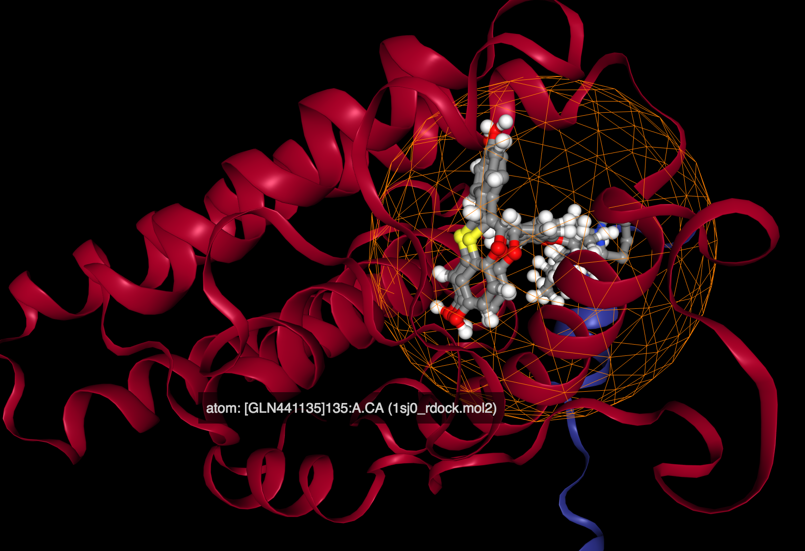

# Pose validation for human estrogen receptor alpha

This protocol validates the poses that are generated by docking by re-docking the
known ligand to the protein and comparing the docked poses with the original ligand
that provides the "correct" answer.

This broadly follows the procedure for docking pose validation that is described
for rDock [here](http://rdock.sourceforge.net/validation-sets/#ASTEX).

The target is PDB code [1SJ0](https://www.rcsb.org/pdb/explore/explore.do?structureId=1sj0).

Docking is performed using rDock as described in that link except that only the top 10
scoring poses are kept out of a total of 50.

Docking is also performed using PLANTS, generating 10 poses.

## Running

### 1. copy files

```sh
./1_copy_files.sh
```

The result are the files 1sj0_ligand.sd 1sj0_rdock.mol2 and 1sj0_rdock.prm copied from the
Astex validation set found [here](../../../../datasets/ASTEX_rDock_TestSet/).


### 2. Create cavity

Cavity definition using the rbcavity program

```sh
./2_create_cavity.sh
```

The result are the files 1sj0_cavity.log and 1sj0_rdock.as.
The second of these is the cavity defintion


### 3. Run rDock docking

```sh
./3_run_rdock.sh
```

This runs rDock, sorts and filters the results and generates the RMSD values comparing
the docked poses to the real ligands.

The result are the files 1sj0_rdock_out.sd, 1sj0_rdock_out_sorted.sd and rdock.rmsd

### 4. Run PLANTS docking

```sh
./4_run_plants.sh
```
This runs PLANTS and generates the RMSD values using the same program used for rDock.
The sphere definition used by PLANTS is based on the cavity defintion that was generated 
by rDock.

The result are the files in the results_plants directory and plants.rmsd


## Viewing

To view the results drag the following files to a [NGL viewer window](http://nglviewer.org/ngl/):

* 1sj0_rdock.mol2 (the protein)
* 1sj0_ligand.mol2 (the original ligand)
* 1sj0_rdock_out.sd (the rDock docked structures - you only see the first one)
* results_plants/LIGAND_entry_00001_conf_01.mol2 (the best PLANTs docked structure)
* ngl-site-sphere.ngl (the cavity definition represented as a sphere e.g. as used by PLANTS)



Viewing in other 3D viewers should also be possible.

## Summary

These settings are adjusted to ensure that rDock and PLANTS takes about the same time to complete.

A superficial analysis of the results indicate that rDock is able to generate a pose with slightly lower 
RMSD, but the methodology needs careful examination before solid conclusions can be drawn.


