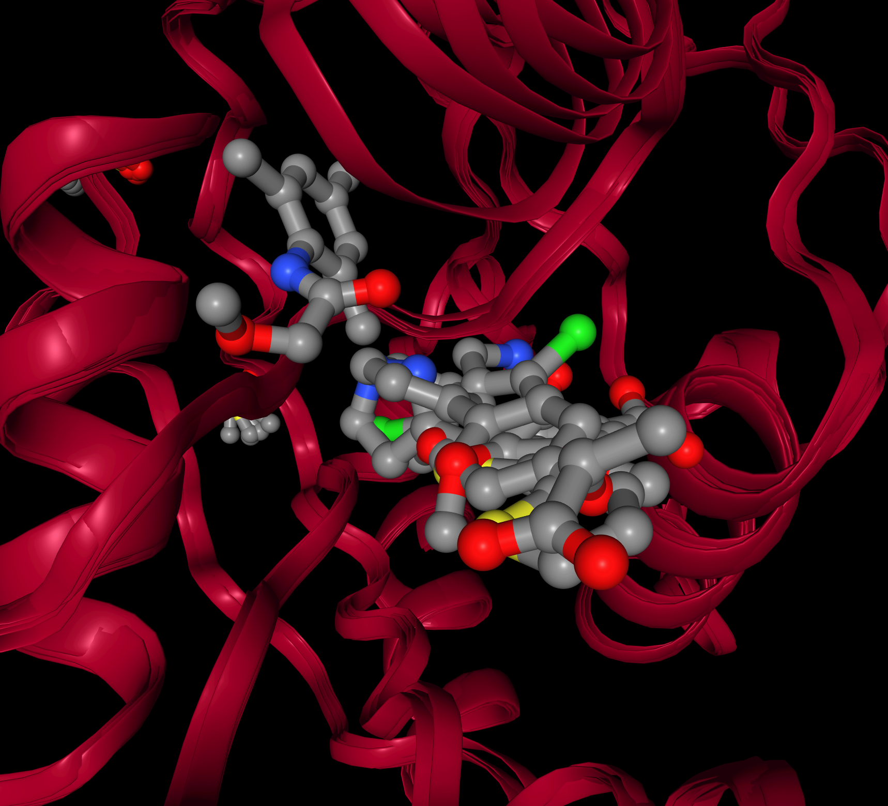
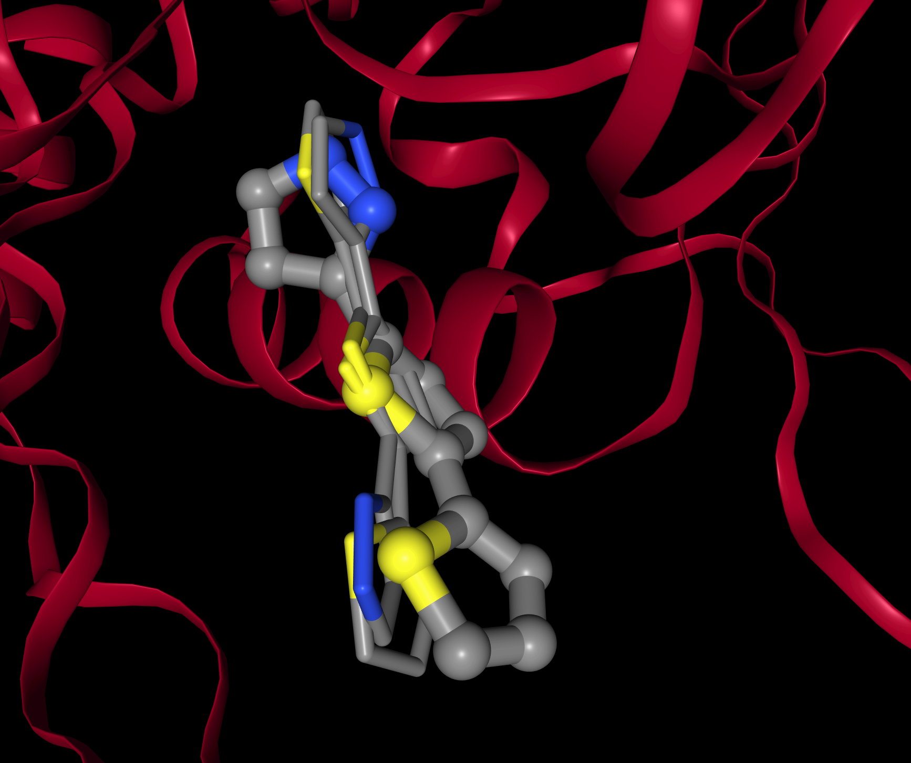

# Protein selection for docking

NOTE: this analysis replaces an earlier version where waters were present in the PDB files, which might be 
expected to lead to misleading results.   

## Introduction

Often you might have multiple crystal structures for a protein, each with different ligands present.
This introduces an extra complexity when docking because you need to work out which one(s) are going
to give you the best results. This is common in fragment screening where you might have multiple fragments
crystallised into the same target protein. Those fragments may explore the extent of the cavity well, but
if you are wanting to use docking to screen potential derivatives of those fragments then you need to 
determine what protein structure(s) you are going to use.

If you are lucky one protein may be good for docking a wide range of ligands. If you are unlucky no single
protein may be good for all and you may need to use multiple proteins.

## Approach

The approach taken here is to try to re-dock all of the ligands into all of the proteins and see how well
each protein docks each ligand, based on RMSD values of the docked ligand and the coordinates of that
ligand in its own crystal structure. Hopefully the protein which contained the ligand is a good receptor
for that ligand, but is it also a good receptor for the other ligands.

RDock is used for the docking.

## Dataset

The data is a small subset of data from fragment screening of NUDT7A performed by the [SGC](https://www.thesgc.org/) at the Diamond Light
Source's [XChem project](https://www.diamond.ac.uk/Instruments/Mx/Fragment-Screening.html). More info on that target at the SGC can be found [here](https://www.thesgc.org/tep/nudt7).The 5 structures were selected and prepared by Anthony Bradley. The ligands were removed to generate apo structures and all waters were removed. Proteins are in PDB format, ligands in MOLFILE format. The proteins are already aligned and there is only small variation on the protein backbone between the different structures.

The ligands for NUDT7A-x0129, NUDT7A-x0254, NUDT7A-x0384 and NUDT7A-x0389 occupy a very similar region in the cavity whilst NUDT7A-x0151 occupies a different region with no real overlap.


The ligand for NUDT7A-x0151 is to the top left, separate from the 4 other ligands.

## Processing

### 1. copy files

Files are copied from the datasets section.

```
$ ./1_copy_files.sh 
Copying files ...
Files copied. Files are:
NUDT7A-x0129_apo-desolv.pdb  NUDT7A-x0129.mol             NUDT7A-x0151_apo.pdb  NUDT7A-x0254_apo-desolv.pdb  NUDT7A-x0254.mol             NUDT7A-x0384_apo.pdb  NUDT7A-x0389_apo-desolv.pdb  NUDT7A-x0389.mol
NUDT7A-x0129_apo.pdb         NUDT7A-x0151_apo-desolv.pdb  NUDT7A-x0151.mol      NUDT7A-x0254_apo.pdb         NUDT7A-x0384_apo-desolv.pdb  NUDT7A-x0384.mol      NUDT7A-x0389_apo.pdb
Creating SDF with all ligands ...
ligands.sdf created
Done
```

### 2. create cavity

How to define the cavity for each protein is a good question. As fragments are small each one only explores a relatively 
small part of the potential cavity. Any chemistry follow up is going to want to extend the fragment into this larger space.
Hence restricting the cavity to the area around the ligand for that protein may be too restrictive.

RDock provides two ways of defining the cavity. The easier one is to use an existing ligand to define the region of the cavity.
But doing this has the problems described above.

The second is to use the '2 sphere' approach to map out the cavity. That might be a good approach but here we're wanting to 
exploit the ligand information. 

So which ligand to use? Why not use them all as that will nicely map out the region.
The rDock rbcavity program only accepts a single ligand so we make this possible by creating a 'Frankenstein' ligand by
combining the atoms of all ligands into a single molecule. This is done with a [Perl script](select_points_SDF.pl) provided by
Xavier Barril who has previously used this technique. The Frankenstein molecule has only atoms, and no bonds, and 'internal'
atoms that do not contribute to the external surface are excluded. With this ligand we can create a cavity, and as the 
combined ligands should explore the cavity reasonably efficiently we can use a relatively small radius of 3A around those
atoms. See the [parameter file](template.prm) for details.

The cavity definition is generated for each protein with the [2_create_cavity.sh](2_create_cavity.sh) script which does these actions:

1. Creates the actual parameters file for each protein from a template
2. Prepares the protein in MOL2 format using OpenBabel. Note that this is quite a simplistic approach and we plan to come back to this later.
3. Creates the cavity definition using rbcavity and the Frankenstein molecule.

Each protein is handled in its own directory.


```
$ ./2_create_cavity.sh 
Creating Frankenstein ligand ...
V2000
V2000
V2000
V2000
V2000
Processing NUDT7A-x0129_apo-desolv.pdb ...
Creating NUDT7A-x0129.mol2
==============================
*** Open Babel Warning  in PerceiveBondOrders
  Failed to kekulize aromatic bonds in OBMol::PerceiveBondOrders (title is NUDT7A-x0129_apo-desolv.pdb)

1 molecule converted
Creating cavity for NUDT7A-x0129
Processing NUDT7A-x0151_apo-desolv.pdb ...
Creating NUDT7A-x0151.mol2

...

```

### 3. Docking

Docking is done using rDock. As the datasets are small we are not at this stage parallelising this.
Each of the 5 ligands is docked into each of the 5 proteins.
For each ligand-protein combination 50 dockings are performed generating a file named `<molecule-name>_docking.sd`
and the results sorted by the docking score to create the file `<molecule-name>_docking_sorted.sd`.
Then RMSD values are calculated against the pose of the same ligand in its own crystal structure.
Then the lowset RMSD for each molecule in that target and its rank in the scoring is extracted in the file `rmsd.scores`.

Run this with the command:

```
./3_run_rdock.sh
```


## Results

Results were generated with 3 independent runs. The key values are captures in this Excel spreadsheet [rmsds.xlsx](rmsds.xlsx).
The individual RMSD values are the lowest RMSD found amongst the poses compared to the original ligand. If the docking was
perfect the RMSD would be zero. The spreadsheet also reports the rank of that best pose (out of the 50 poses generated). 
The average RMSDs for the 3 runs are (rows are ligands, columns are proteins):

|              | NUDT7A-x0129 | NUDT7A-x0151 | NUDT7A-x0254 | NUDT7A-x0384 | NUDT7A-x0389
| ---          | ---          | ---          | ---          | ---          | ---          
| NUDT7A-x0129 | 1.74	      | 4.25	     | 2.11  	    | 3.07	       | 1.44
| NUDT7A-x0151 | 0.70	      | 1.36	     | 0.71	        | 1.63	       | 5.06
| NUDT7A-x0254 | 4.17	      | 2.82	     | 3.28	        | 4.33	       | 3.57
| NUDT7A-x0384 | 4.98	      | 1.82	     | 4.19	        | 1.46	       | 4.07
| NUDT7A-x0389 | 6.64         | 4.65	     | 5.03	        | 5.21	       | 1.24
| AVERAGE	   | 3.65	      | 2.98	     | 3.07         | 3.14	       | 3.08
| MIN	       | 0.70	      | 1.36	     | 0.71	        | 1.46	       | 1.24
| MAX	       | 6.64	      | 4.65	     | 5.03	        | 5.21	       | 5.06


## Conclusions

A number of interesting conclusions can be made.

Firstly rDock seems to be good at generating the correct pose, but very often that pose is not the best score.
Very often the best RMSD is ranked quite lowly. We do need those 50 dockings to be sure of getting the possibility 
of a good pose.
 
This is seen for NUDT7A-x0389 where the ligand is consistently docked into the same space but two ways round.



The 'best' pose as determined by RMSD to the crystal structure ligand often ranks quite low.
But despite this rDock is mostly able to find the 'correct' pose with most RMSDs of the docked ligand compared that ligands
conformation in the crystal structure being < 2A. The exception is NUDT7A-x0254 which has an average RMSD of 3.28 showing
that this ligand is less accurately docked into its own receptor than for the other ligand/receptor combinations which have 
averages comfortably less than 2.0.

Clearly we need to generate a reasonably large number of poses and not rely on the best scoring ones.

Overall the NUDT7A-x0151 protein seems the best target to use as the sum of the RMSD scores is lowest and it has the lowest
worst score (RMSD of 4.65), but it does not handle 2 of the ligands, NUDT7A-x0129 and NUDT7A-x0389, particularly well. 
The proteins for those two ligands do handle their own ligand well, and NUDT7A-x0389 also handles the NUDT7A-x0129 ligand 
well (but not vice-versa).

So if you wanted to choose only one target to use you would select NUDT7A-x0151. If you wanted to be sure you had better
coverage then you would also need to include NUDT7A-x0389.

## Future work

- Investigate better ways to prepare the protein.
- Investigate the two spheres approach for cavity generation.
- Investigate other docking algorithms.
- Investigate clustering the docking poses and keeping the top scoring pose in each cluster.
- Examine these docking poses with respect to the known hydrogen bonding and other interactions.
- Investigate whether keeping specific water molecules in the protein structure can improve results.
- Extend to other datasets.


