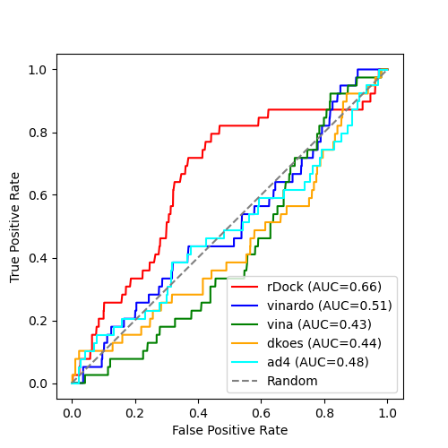

# Comparison of rDock and Smina

**Target**: SARS Coronavirus 3C-like Protease (the original SARS virus).

This is a repeat of the work desscribed for validating rDock and Smina for
DHFR. Look [here](../../../dhfr/expts/vs-dekois/README.md) for that data and
for the methodology.

# Results

| tool            | # actives in top 100 |
|-----------------|----------------------|
| rDock           | 7  |
| Smina - vina    | 1  |
| Smina - vinardo | 2  |
| Smina - dkoes   | 4  |
| Smina - ad4     | 5  |

rDock is the only one that performs at all, and even then not very well, especially in relation to early recall.

