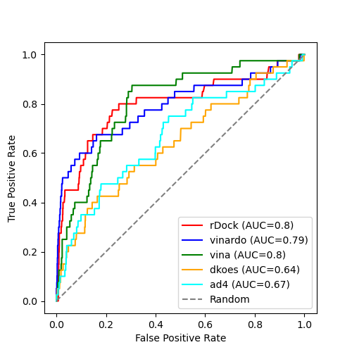

# Comparison of rDock and Smina

**Target**: Thrombin.

This is a repeat of the work desscribed for validating rDock and Smina for
DHFR. Look [here](../../../dhfr/expts/vs-dekois/README.md) for that data and
for the methodology.

# Results

| tool            | # actives in top 100 |
|-----------------|----------------------|
| rDock           | 18 |
| Smina - vina    | 15 |
| Smina - vinardo | 22 |
| Smina - dkoes   | 9  |
| Smina - ad4     | 22 |

rDock and Smina with the vina or vinardo scoring function all perform well with very similar AUC values,
with vinardo the best due to the better early recall figure. The dkoes and ad4 also perform acceptably,
but not as well.

